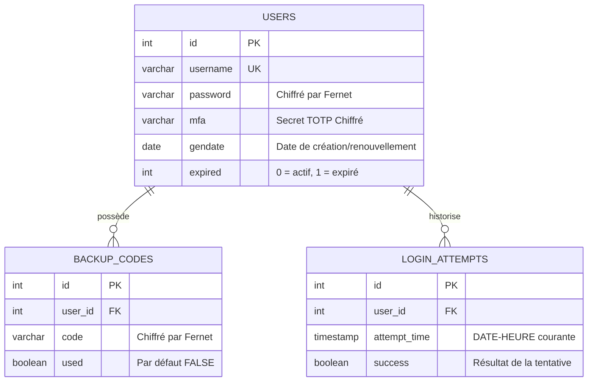
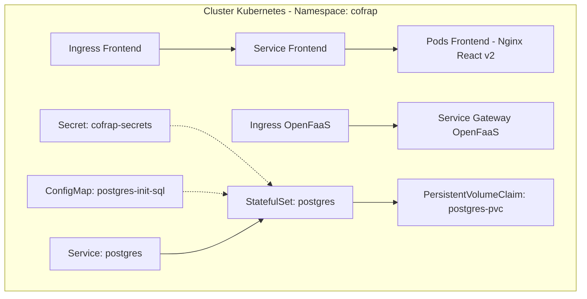

# DOCUMENTATION TECHNIQUE ET FONCTIONNELLE EXHAUSTIVE : PLATEFORME COFRAP

Bienvenue dans la documentation officielle de **COFRAP (Serverless Authentication Platform)**. Ce document détaille de manière approfondie le fonctionnement fonctionnel et technique de l'application, l'architecture logicielle, la structure de la base de données, les spécifications des fonctions, ainsi que l'ensemble des procédures de déploiement sur serveur via **Git**, **Kubernetes (K3s)** et **OpenFaaS**.

---

## 1. ARCHITECTURE FONCTIONNELLE

COFRAP est une plateforme d'authentification moderne conçue sur des principes stricts de sécurité. L'objectif principal de la plateforme est de supprimer la création de mots de passe faibles par l'utilisateur final en centralisant la génération et le renouvellement de secrets cryptographiques forts, renforcés par une authentification multifacteur (MFA).

### 1.1. Concepts de Sécurité et Politiques Métier

1. **Génération de mot de passe par le serveur** : L'utilisateur ne choisit jamais son mot de passe. Lors de l'inscription, le système génère aléatoirement une chaîne hautement sécurisée de 24 caractères (comprenant lettres majuscules/minuscules et chiffres). Ce mot de passe est transmis sous forme de texte et de code QR au client, et n'est plus jamais réaffiché par la suite.
2. **Double Facteur Obligatoire (TOTP - Time-Based One-Time Password)** : La connexion requiert systématiquement un jeton TOTP à 6 chiffres, généré par une application d'authentification (ex: Google Authenticator, FreeOTP) configurée via le scan d'un QR code contenant l'URI de provisionnement TOTP standardisée.
3. **Codes de secours (Backup Codes)** : Lors de l'initialisation du 2FA, 5 codes de secours uniques de 8 caractères sont générés et chiffrés. Ils permettent à l'utilisateur d'accéder à son compte en cas de perte de son appareil TOTP. Chaque code n'est utilisable **qu'une seule fois**.
4. **Expiration stricte des mots de passe (Politique des 90 jours)** : Les mots de passe générés ont une durée de validité maximale de 90 jours. Une fois ce délai dépassé, ou si l'administrateur marque manuellement le compte comme expiré, l'utilisateur est redirigé lors de sa connexion vers un parcours de renouvellement obligatoire.

### 1.2. Parcours Utilisateur Détaillés

#### A. Inscription et Initialisation de la Sécurité
Le processus d'inscription se déroule en **4 étapes chronologiques** au sein de l'interface :
1. **Saisie de l'identifiant** : L'utilisateur fournit un nom d'utilisateur (entre 8 et 20 caractères, validé par regex). La fonction backend crée l'utilisateur en base de données, génère son mot de passe de 24 caractères, le chiffre et retourne le QR Code correspondant au mot de passe brut.
2. **Récupération du mot de passe** : L'utilisateur scanne le code QR pour obtenir son mot de passe de 24 caractères. Il doit coller ce mot de passe dans le champ de saisie pour valider qu'il l'a bien sauvegardé.
3. **Configuration du double facteur (2FA)** : Le backend génère une clé secrète TOTP et 5 codes de secours à usage unique. Un QR code s'affiche à l'écran permettant à l'utilisateur de lier son application TOTP (Google Authenticator, etc.).
4. **Finalisation et Validation** : L'utilisateur saisit le code 2FA à 6 chiffres généré par son application mobile. Le backend valide ce code. Si la validation réussit, l'inscription est validée et l'utilisateur est invité à se connecter.

#### B. Connexion standard (Login)
1. L'utilisateur saisit son nom d'utilisateur, son mot de passe généré de 24 caractères et son code TOTP actuel à 6 chiffres.
2. Le backend vérifie la validité des informations d'identification, déchiffre le mot de passe stocké et compare les valeurs.
3. Le backend calcule la durée écoulée depuis la création du mot de passe. Si elle dépasse 90 jours ou si le champ `expired` vaut 1, le statut `expired_password` est retourné, entraînant une redirection du frontend vers la page de renouvellement.
4. Si toutes les étapes de validation réussissent (mot de passe correct, compte non expiré, code TOTP valide), la tentative est enregistrée comme un succès et l'accès est accordé.

#### C. Renouvellement des identifiants (Password & MFA Expirés)
1. L'utilisateur est redirigé vers l'interface de renouvellement.
2. Après avoir validé son identifiant, le système déclenche la génération d'un nouveau mot de passe fort de 24 caractères et la réinitialisation complète du module MFA (nouvelle clé secrète TOTP et nouveaux codes de secours).
3. Les nouveaux codes QR de mot de passe et de clé TOTP sont présentés pour que l'utilisateur reconfigure ses applications et enregistre ses nouvelles clés de secours.

#### D. Récupération par code de secours (Perte de 2FA)
1. Sur la page de connexion, l'utilisateur clique sur "Mot de passe perdu ?".
2. Il saisit son identifiant et l'un de ses 5 codes de secours à 8 caractères générés lors de l'inscription.
3. Le backend vérifie l'existence et la validité du code de secours (en décryptant les codes non utilisés associés à l'utilisateur).
4. En cas de correspondance, le code de secours utilisé est marqué comme `used = TRUE` en base de données.
5. Le système génère automatiquement un nouveau mot de passe temporaire fort de 12 caractères et met à jour la table des utilisateurs en réinitialisant le drapeau d'expiration.
6. Le nouveau mot de passe s'affiche sous forme de QR Code et l'utilisateur peut à nouveau se connecter.

---

## 2. ARCHITECTURE TECHNIQUE & CHOIX TECHNOLOGIQUES

L'application repose sur une architecture Cloud Native découplée, utilisant des conteneurs légers orchestrés sur Kubernetes et des fonctions Serverless exécutées à la demande.

### 2.1. Tableau des Technologies par Tâche

| Tâche / Composant | Technologie Utilisée | Rôle / Rationale |
| :--- | :--- | :--- |
| **Interface Utilisateur** | **React 18** & **Vite** | Bibliothèque moderne pour créer des SPA rapides et réactives. Vite assure un packaging et un rechargement à chaud ultra-performants. |
| **Mise en page & Design** | **TailwindCSS** & **CSS natif** | Framework utilitaire CSS pour concevoir une interface esthétique, moderne, adaptative et dotée d'animations fluides. |
| **Serveur Web Frontend** | **Nginx (Alpine)** | Serveur HTTP léger utilisé pour servir les assets statiques compilés du frontend React au sein du cluster Kubernetes. |
| **Routage Frontend** | **react-router-dom** | Gestion du cycle de vie des URL côté client pour les vues de Connexion, Inscription, Réparation et Renouvellement. |
| **Moteur Backend** | **OpenFaaS** (Open Function as a Service) | Plateforme Serverless permettant d'exécuter des fonctions à la demande sous forme de micro-conteneurs scalables et isolés. |
| **Langage de Scripting** | **Python 3** (Modèle `python3-http`) | Langage de script robuste pour implémenter la logique des fonctions backend de manière concise et performante. |
| **Authentification Double Facteur**| **PyOTP** (Bibliothèque Python) | Implémentation standardisée des algorithmes TOTP (RFC 6238) pour la génération et validation de jetons à validité temporelle. |
| **Sécurité & Chiffrement** | **Cryptography (Fernet)** | Bibliothèque de chiffrement symétrique garantissant l'inviolabilité des données sensibles (mots de passe, secrets TOTP, codes de secours) stockées en base de données. |
| **Génération de Codes QR** | **qrcode** & **Pillow** (Python) | Création dynamique d'images de codes QR encodées en Base64 PNG pour une transmission directe au client sans stockage de fichiers temporaires. |
| **Moteur de Base de Données** | **PostgreSQL 16** | Système de gestion de base de données relationnelle (SGBDR) robuste pour la persistance des utilisateurs et l'historisation des tentatives de connexion. |
| **Driver PostgreSQL** | **Psycopg2** (Python) | Adaptateur de base de données PostgreSQL pour Python, utilisé par les fonctions pour interagir de manière transactionnelle avec la base. |
| **Orchestration / Cluster** | **Kubernetes (K3s)** | Distribution Kubernetes légère certifiée CNCF idéale pour le déploiement sur serveur ou en local de toute l'infrastructure (Frontend, Postgres, Traefik). |
| **Routage de trafic / Ingress**| **Traefik Ingress Controller** | Contrôleur d'accès HTTP et middleware de routage (gestion des CORS, réécriture d'URL, acheminement vers OpenFaaS ou Frontend). |
| **Gestion des Conteneurs** | **Docker** & **Containerd** | Outils de construction d'images applicatives et runtime de conteneurs exécutant les charges de travail du cluster. |

---

## 3. ARCHITECTURE DE LA BASE DE DONNÉES (POSTGRESQL)

Le stockage des données est assuré par un serveur PostgreSQL sécurisé et isolé. Les scripts d'initialisation de la base de données sont définis dans le fichier [03-postgres-configmap.yaml](file:///home/ubuntu/mspr-auth-serverless-dev-fin/k8s/03-postgres-configmap.yaml).

### 3.1. Structure et Dictionnaire des Données



#### Table 1 : `users`
Stocke l'identité des utilisateurs, leurs secrets d'authentification principaux chiffrés et l'état de validité de leur mot de passe.
* **`id`** (`SERIAL PRIMARY KEY`) : Identifiant unique auto-incrémenté.
* **`username`** (`VARCHAR(100) NOT NULL UNIQUE`) : Nom d'utilisateur unique (8 à 20 caractères alphanumériques).
* **`password`** (`VARCHAR(255) NOT NULL`) : Mot de passe de 24 caractères généré par le serveur, chiffré symétriquement en AES via Fernet avant stockage.
* **`mfa`** (`VARCHAR(100) DEFAULT ''`) : Clé de configuration TOTP (secret Base32) générée de façon aléatoire, chiffrée symétriquement en AES avant stockage.
* **`gendate`** (`DATE NOT NULL`) : Date de génération du mot de passe actuel. Sert de référence temporelle pour calculer la validité de 90 jours.
* **`expired`** (`INTEGER NOT NULL DEFAULT 0`) : Indicateur binaire d'expiration (0 = Actif / 1 = Expiré).

#### Table 2 : `backup_codes`
Stocke les codes de secours chiffrés permettant le rétablissement de l'accès au compte en cas de perte du périphérique MFA.
* **`id`** (`SERIAL PRIMARY KEY`) : Identifiant unique du code.
* **`user_id`** (`INTEGER NOT NULL REFERENCES users(id) ON DELETE CASCADE`) : Clé étrangère pointant vers l'utilisateur propriétaire, avec suppression en cascade.
* **`code`** (`VARCHAR(100) NOT NULL`) : Code de secours de 8 caractères alphanumériques généré aléatoirement et chiffré symétriquement en AES via Fernet avant stockage.
* **`used`** (`BOOLEAN NOT NULL DEFAULT FALSE`) : Statut d'utilisation (devient `TRUE` dès que le code est validé lors d'un processus de récupération).

#### Table 3 : `login_attempts`
Historise toutes les tentatives de connexion pour des besoins d'audit de sécurité et de détection d'intrusions (brute force).
* **`id`** (`SERIAL PRIMARY KEY`) : Identifiant de la tentative.
* **`user_id`** (`INTEGER NOT NULL REFERENCES users(id) ON DELETE CASCADE`) : Clé étrangère pointant vers l'utilisateur concerné, avec suppression en cascade.
* **`attempt_time`** (`TIMESTAMP DEFAULT CURRENT_TIMESTAMP`) : Horodatage exact de la tentative de connexion.
* **`success`** (`BOOLEAN NOT NULL`) : Résultat de l'authentification (`TRUE` pour un succès, `FALSE` pour un échec).

### 3.2. Mécanisme de Chiffrement des Données

Afin de se prémunir contre les fuites de données en cas d'accès direct ou de compromission de la base de données, toutes les données hautement sensibles (`password`, `mfa`, `code`) sont chiffrées avant leur insertion.
* **Algorithme** : Chiffrement symétrique **Fernet** (implémentation de la spécification de chiffrement symétrique sécurisé AES en mode CBC avec signature HMAC-SHA256).
* **Clé d'encryption** : Lue en priorité depuis le fichier de secret partagé Kubernetes `/var/openfaas/secrets/encryption-key` présent dans le runtime OpenFaaS. En l'absence de ce fichier secret, une clé par défaut configurée en variable d'environnement (`ENCRYPTION_KEY`) est utilisée.
* **Processus** :
  * *Écriture* : Les données textuelles sont encodées en UTF-8, chiffrées via l'objet Fernet, puis stockées sous forme de chaînes de caractères ASCII chiffrées.
  * *Lecture* : La chaîne chiffrée est extraite de la base de données, déchiffrée par l'objet Fernet avec la même clé secrète, puis décodée en UTF-8 pour être manipulée par le code métier backend.

---

## 4. CONSTITUTION DES FONCTIONS BACKEND (OPENFAAS)

Chaque fonction backend est configurée de manière indépendante dans le fichier [stack.yaml](file:///home/ubuntu/mspr-auth-serverless-dev-fin/stack.yaml), utilisant le template `python3-http` d'OpenFaaS pour interagir avec le serveur via des requêtes/réponses JSON. Toutes les fonctions implémentent la gestion des en-têtes CORS pour autoriser l'accès cross-origin depuis l'application frontend.

### 4.1. generate-password
* **Fichier source** : [handler.py (generate-password)](file:///home/ubuntu/mspr-auth-serverless-dev-fin/functions/generate-password/handler.py)
* **Objectif** : Valider le format de l'identifiant utilisateur demandé, l'enregistrer s'il est disponible et retourner un mot de passe unique sous forme de QR code.
* **Requête entrante (JSON POST)** :
  ```json
  {
    "username": "nom_utilisateur"
  }
  ```
* **Logique et Traitement** :
  1. Extraction et nettoyage du champ `username`.
  2. Validation de l'identifiant par expression régulière : `^[a-zA-Z0-9_.-]{8,20}$`. Si invalide, retour d'une erreur 400.
  3. Connexion à la base de données PostgreSQL.
  4. Requête de vérification de l'existence du nom d'utilisateur. S'il existe déjà, retour d'une erreur 400 (`username_already_exists`).
  5. Génération aléatoire d'un mot de passe fort de 24 caractères (mélange de lettres minuscules, majuscules et chiffres via la bibliothèque standard `string` et `random`).
  6. Chiffrement symétrique du mot de passe généré avec la clé Fernet.
  7. Insertion du nouvel utilisateur en base avec la date du jour dans `gendate` et `expired = 0`.
  8. Génération d'une image de code QR de type PNG contenant le mot de passe brut (en clair) à l'aide de la bibliothèque `qrcode`.
  9. Encodage de l'image binaire PNG en chaîne Base64.
* **Réponse de sortie en cas de succès (HTTP 200)** :
  ```json
  {
    "qr_code": "iVBORw0KGgoAAAANS..." // Chaîne Base64 de l'image PNG du code QR
  }
  ```
* **Codes de statut HTTP et erreurs possibles** :
  * `200 OK` : Inscription initiale réussie.
  * `400 Bad Request` : Corps JSON invalide, champ `username` absent, format d'identifiant invalide (`invalid_username_format`), ou utilisateur existant (`username_already_exists`).
  * `405 Method Not Allowed` : Requête non-POST (hors OPTIONS pour CORS).
  * `500 Internal Server Error` : Erreur de connexion ou d'écriture en base de données.

### 4.2. generate-2fa
* **Fichier source** : [handler.py (generate-2fa)](file:///home/ubuntu/mspr-auth-serverless-dev-fin/functions/generate-2fa/handler.py)
* **Objectif** : Activer le double facteur (MFA) pour un utilisateur existant en fournissant son mot de passe initial, générer la clé secrète TOTP et fournir des codes de secours chiffrés.
* **Requête entrante (JSON POST)** :
  ```json
  {
    "username": "nom_utilisateur",
    "password": "mot_de_passe_24_caracteres"
  }
  ```
* **Logique et Traitement** :
  1. Extraction de l'identifiant et du mot de passe depuis le payload.
  2. Recherche de l'utilisateur en base de données. Si introuvable, retour d'une erreur 404 (`User not found`).
  3. Récupération et déchiffrement du mot de passe stocké. Comparaison avec le mot de passe fourni. En cas de différence, retour d'une erreur 400 (`invalid_password`).
  4. Génération d'un secret TOTP aléatoire codé en Base32 standard (via `pyotp.random_base32()`).
  5. Génération d'un URI de provisionnement standardisé : `otpauth://totp/COFRAP:nom_utilisateur?secret=SECRET&issuer=COFRAP`.
  6. Génération de 5 codes de secours aléatoires à usage unique (chaînes de 8 caractères composées de majuscules et de chiffres).
  7. Chiffrement individuel des 5 codes de secours avec la clé Fernet.
  8. Suppression des anciens codes de secours associés à cet utilisateur et insertion des 5 nouveaux codes dans la table `backup_codes` avec le statut `used = FALSE`.
  9. Mise à jour de la table `users` en insérant le secret TOTP en clair dans la colonne `mfa`.
  10. Génération du QR Code de configuration TOTP (PNG encodé en Base64).
* **Réponse de sortie en cas de succès (HTTP 200)** :
  ```json
  {
    "qr_code": "iVBORw0KGgoAAAANS...", // QR code contenant l'URI de configuration TOTP
    "backup_codes": ["X5Y9Z8W7", "A1B2C3D4", "E5F6G7H8", "I9J0K1L2", "M3N4O5P6"] // Codes en clair (à sauvegarder)
  }
  ```
* **Codes de statut HTTP et erreurs possibles** :
  * `200 OK` : MFA initialisé avec succès.
  * `400 Bad Request` : Champs manquants, ou mot de passe incorrect (`invalid_password`).
  * `404 Not Found` : Utilisateur inexistant.
  * `500 Internal Server Error` : Problème avec la base de données.

### 4.3. authenticate
* **Fichier source** : [handler.py (authenticate)](file:///home/ubuntu/mspr-auth-serverless-dev-fin/functions/authenticate/handler.py)
* **Objectif** : Gérer l'authentification complète des utilisateurs en validant l'identifiant, le mot de passe et le jeton TOTP temporaire, tout en vérifiant l'expiration du compte.
* **Requête entrante (JSON POST)** :
  ```json
  {
    "username": "nom_utilisateur",
    "password": "mot_de_passe_24_caracteres",
    "totp_code": "123456"
  }
  ```
* **Logique et Traitement** :
  1. Récupération des champs `username`, `password` et `totp_code`.
  2. Recherche de l'utilisateur dans la table `users`. Si absent, retour d'une erreur 401 (`invalid_credentials`).
  3. Déchiffrement du mot de passe stocké et comparaison avec le mot de passe fourni.
  4. Si le mot de passe est incorrect : insertion d'une ligne d'échec (`success = FALSE`) dans la table `login_attempts` et retour d'une erreur 401 (`invalid_credentials`).
  5. Vérification de l'âge du mot de passe :
     * Calcul de la différence en jours entre la date actuelle et la date `gendate`.
     * Si la différence est supérieure à 90 jours ou si le flag `expired` vaut 1, retour d'une erreur 401 contenant l'indicateur d'expiration (`{"error": "expired_password", "expired": true}`).
  6. Vérification de la configuration MFA : Si le champ `mfa` est vide, retour d'une erreur 401 (`mfa_not_configured`).
  7. Instanciation du validateur TOTP via la bibliothèque `pyotp` avec la clé secrète stockée dans le champ `mfa`.
  8. Validation du jeton `totp_code` à 6 chiffres. Si le code est incorrect, insertion d'une ligne d'échec dans `login_attempts` et retour d'une erreur 401 (`invalid_totp`).
  9. Si tout est valide : insertion d'une ligne de succès (`success = TRUE`) dans la table `login_attempts` et validation de l'authentification.
* **Réponse de sortie en cas de succès (HTTP 200)** :
  ```json
  {
    "status": "success",
    "message": "Authentification reussie"
  }
  ```
* **Codes de statut HTTP et erreurs possibles** :
  * `200 OK` : Connexion acceptée.
  * `400 Bad Request` : Paramètres requis manquants.
  * `401 Unauthorized` : Identifiants invalides (`invalid_credentials`), mot de passe périmé (`expired_password`), MFA non configuré (`mfa_not_configured`), ou jeton TOTP invalide (`invalid_totp`).
  * `500 Internal Server Error` : Panne ou erreur de base de données.

### 4.4. recover-with-backup-code
* **Fichier source** : [handler.py (recover-with-backup-code)](file:///home/ubuntu/mspr-auth-serverless-dev-fin/functions/recover-with-backup-code/handler.py)
* **Objectif** : Permettre la réinitialisation du mot de passe d'un utilisateur en cas de perte de sa clé TOTP, en validant l'un de ses codes de secours non consommés.
* **Requête entrante (JSON POST)** :
  ```json
  {
    "username": "nom_utilisateur",
    "backup_code": "X5Y9Z8W7"
  }
  ```
* **Logique et Traitement** :
  1. Récupération de l'identifiant et du code de secours saisi.
  2. Recherche de l'utilisateur par son nom d'utilisateur. S'il n'existe pas, retour d'une erreur 401 (`invalid_credentials`).
  3. Sélection de tous les codes de secours associés à cet utilisateur dont le champ `used` est égal à `FALSE`.
  4. Pour chaque code récupéré, déchiffrement avec la clé Fernet et comparaison insensible à la casse avec le code de secours fourni.
  5. Si aucun code ne correspond, retour d'une erreur 401 (`invalid_backup_code`).
  6. Si un code correspond : mise à jour de sa ligne dans la table `backup_codes` en passant le flag `used` à `TRUE` pour empêcher toute réutilisation future.
  7. Génération d'un nouveau mot de passe aléatoire plus court (12 caractères) pour la réinitialisation rapide de secours.
  8. Chiffrement de ce nouveau mot de passe et mise à jour de l'enregistrement de l'utilisateur en base de données. Le champ `expired` est réinitialisé à 0 et la date de génération `gendate` est mise à jour avec la date courante.
  9. Génération du QR Code PNG contenant le nouveau mot de passe brut, encodé en Base64.
* **Réponse de sortie en cas de succès (HTTP 200)** :
  ```json
  {
    "qr_code": "iVBORw0KGgoAAAANS..." // Nouveau mot de passe encodé sous forme de QR Code
  }
  ```
* **Codes de statut HTTP et erreurs possibles** :
  * `200 OK` : Récupération effectuée et mot de passe réinitialisé.
  * `400 Bad Request` : Paramètres de requête incorrects ou manquants.
  * `401 Unauthorized` : Utilisateur introuvable ou code de secours invalide/déjà utilisé.
  * `500 Internal Server Error` : Problème avec la base de données.

---

## 5. ARCHITECTURE ET LOGIQUE DU FRONTEND (REACT / VITE)

L'interface utilisateur est construite sous forme de Single Page Application (SPA). Elle s'exécute entièrement dans le navigateur de l'utilisateur et communique de manière asynchrone avec les fonctions d'API.

### 5.1. Structure du Code Source
Les fichiers frontend se situent dans le sous-dossier `/frontend` :
* [App.jsx](file:///home/ubuntu/mspr-auth-serverless-dev-fin/frontend/src/App.jsx) : Le cœur de l'application contenant tous les écrans, la gestion de l'état local et la configuration des routes.
* [main.jsx](file:///home/ubuntu/mspr-auth-serverless-dev-fin/frontend/src/main.jsx) : Point d'entrée React montant le composant principal `App` dans le DOM HTML.
* [index.html](file:///home/ubuntu/mspr-auth-serverless-dev-fin/frontend/index.html) : Fichier HTML racine contenant la balise cible `<div id="root">`.
* [vite.config.js](file:///home/ubuntu/mspr-auth-serverless-dev-fin/frontend/vite.config.js) : Configuration du bundler Vite.
* [package.json](file:///home/ubuntu/mspr-auth-serverless-dev-fin/frontend/package.json) : Liste des dépendances npm (React, React Router DOM, PostCSS, TailwindCSS).

### 5.2. Gestion du Routage Applicatif
Le composant [App.jsx](file:///home/ubuntu/mspr-auth-serverless-dev-fin/frontend/src/App.jsx) utilise `react-router-dom` pour le routage. Les routes suivantes sont configurées :
* `/` et `/login` : Affiche l'écran de connexion principale (`Login`).
* `/register` : Lance le parcours d'inscription en 4 étapes (`Register`).
* `/renew` : Affiche le formulaire de renouvellement forcé d'identifiants (`Renew`).
* `/recover` : Affiche l'écran de récupération par code de secours (`Recover`).
* `*` (Route par défaut) : Redirige vers `/login`.

### 5.3. Communication API et Helper `apiCall`
Pour standardiser les échanges réseau, l'application utilise une fonction utilitaire `apiCall(endpoint, payload)`.
* **Configuration du Gateway** : La variable `API_BASE` est lue au démarrage depuis la variable d'environnement `VITE_GATEWAY_URL` via `import.meta.env.VITE_GATEWAY_URL`. Si elle est absente, elle prend une chaîne vide par défaut (ce qui signifie que les requêtes sont routées de manière relative vers le même hôte).
* **Traitement** :
  1. Envoie une requête HTTP `POST` à l'adresse `${API_BASE}${endpoint}`.
  2. Spécifie l'en-tête `"Content-Type": "application/json"`.
  3. Sérialise l'objet `payload` en chaîne de caractères JSON.
  4. Récupère la réponse. Si la requête réseau échoue, retourne un message d'erreur clair.
  5. Si le serveur répond avec une erreur (statut HTTP non-2xx), extrait le message d'erreur retourné par le backend et le propage à l'interface graphique.

### 5.4. Compilation et Routage Nginx
Lors de la production, les fichiers React sont compilés de manière statique via Vite (`npm run build`), générant des fichiers HTML/JS/CSS optimisés dans le dossier `/dist`.
Pour exécuter l'application, l'image Docker frontend lance un serveur HTTP **Nginx**. La configuration de routage [nginx.conf](file:///home/ubuntu/mspr-auth-serverless-dev-fin/frontend/nginx.conf) inclut l'annotation indispensable pour les applications SPA :
```nginx
location / {
    root /usr/share/nginx/html;
    index index.html index.htm;
    try_files $uri $uri/ /index.html;
}
```
* **Explication** : Cette directive indique à Nginx de vérifier si l'adresse demandée (ex: `/register` ou `/renew`) correspond à un fichier réel sur le disque. Si ce n'est pas le cas, Nginx sert systématiquement le fichier `/index.html`. C'est ensuite le routeur JavaScript (`react-router-dom`) qui prend le relais pour afficher le composant adéquat sans renvoyer d'erreur HTTP 404.

---

## 6. GUIDE DE DÉPLOIEMENT COMPLET SUR LE SERVEUR

Cette section décrit les étapes de déploiement manuel ou automatisé sur un serveur Linux équipé d'un cluster Kubernetes K3s et d'un routeur Traefik.

### 6.1. Publication et Versioning sur Git
Afin de synchroniser le code de l'application avec le dépôt distant GitHub :

1. **Initialisation de l'espace de travail (si non fait)** :
   ```bash
   git init
   git remote add origin https://github.com/LyndaALGANI/mspr-auth-serverless.git
   ```
2. **Ajout et Commit des modifications** :
   ```bash
   git add .
   git commit -m "Documentation complète et configuration Kubernetes finalisée"
   ```
3. **Pousser les fichiers sur la branche principale** :
   ```bash
   git branch -M main
   git push -u origin main
   ```
   > [!IMPORTANT]
   > L'authentification par mot de passe simple ayant été désactivée par GitHub, vous devez obligatoirement saisir votre nom d'utilisateur et utiliser un **Personal Access Token (PAT)** généré dans les paramètres de votre compte GitHub en guise de mot de passe lors de l'invite de commande.

---

### 6.2. Déploiement de l'Infrastructure Kubernetes

Le déploiement des objets s'effectue dans le namespace dédié `cofrap`. Les manifests yaml sont situés dans le dossier `/k8s`.



#### Étape 1 : Création du Namespace
Crée l'espace d'isolation logique `cofrap` au sein du cluster.
```bash
kubectl apply -f k8s/01-namespace.yaml
```

#### Étape 2 : Création des Secrets
Génère les clés d'environnement sensibles pour la base de données et l'encryption.
```bash
kubectl apply -f k8s/02-secrets.yaml
```
* *Note technique* : Le secret contient `ENCRYPTION_KEY` (clé Fernet AES) et `DATABASE_URL` (chaîne de connexion PostgreSQL pointant vers le service DNS interne de Kubernetes `postgres.cofrap.svc.cluster.local`).

#### Étape 3 : Initialisation et Déploiement de PostgreSQL
1. **Appliquer la structure SQL** : Le fichier [03-postgres-configmap.yaml](file:///home/ubuntu/mspr-auth-serverless-dev-fin/k8s/03-postgres-configmap.yaml) contient le script `init.sql` définissant la structure des tables.
   ```bash
   kubectl apply -f k8s/03-postgres-configmap.yaml
   ```
2. **Allouer le stockage persistant** : Déploie le PVC pour réserver un espace de stockage persistant qui survivra aux redémarrages de pods.
   ```bash
   kubectl apply -f k8s/04-postgres-pvc.yaml
   ```
3. **Créer le Service Interne** : Expose le port 5432 au sein du réseau interne Kubernetes.
   ```bash
   kubectl apply -f k8s/05-postgres-service.yaml
   ```
4. **Lancer le Pod Base de Données** : Déploie le StatefulSet PostgreSQL 16 Alpine qui monte le stockage PVC dans `/var/lib/postgresql/data` et exécute automatiquement les scripts d'initialisation SQL situés dans `/docker-entrypoint-initdb.d` issus du ConfigMap.
   ```bash
   kubectl apply -f k8s/06-postgres-statefulset.yaml
   ```

#### Étape 4 : Configuration des En-têtes CORS pour le Serveur Traefik
Traefik est le reverse-proxy par défaut de K3s. Afin d'autoriser les requêtes asynchrones en provenance du frontend vers le backend, appliquez le middleware de configuration CORS :
```bash
kubectl apply -f k8s/11-traefik-cors-middleware.yaml
```

---

### 6.3. Déploiement et Configuration d'OpenFaaS

OpenFaaS doit être préinstallé dans le cluster Kubernetes (généralement dans le namespace `openfaas`).

#### Étape 1 : Provisionnement du Secret d'Encryption dans OpenFaaS
Les fonctions Python s'exécutent au sein du cluster OpenFaaS. Pour qu'elles puissent déchiffrer les mots de passe et clés secrètes en base de données, vous devez créer le secret `encryption-key` à l'aide de la CLI OpenFaaS :
```bash
faas-cli secret create encryption-key --value "Rt9LIv0sl8hVk_UjrxDB2QoACvrPoJmVVxuM5OdM5_o=" --gateway http://51.210.104.236
```
> **Note** : La passerelle (gateway) utilisée est définie sur l'adresse externe `http://51.210.104.236` configurée dans le fichier `stack.yaml`.

#### Étape 2 : Déploiement des Fonctions
À la racine du projet, lancez le cycle complet de construction et d'application :
```bash
faas-cli up -f stack.yaml
```
* **Explication** : Cette commande construit les images Docker locales de chaque fonction, les pousse vers votre registre Docker Hub (`lyndaalga/cofrap-X:latest`) et notifie OpenFaaS pour qu'il mette à jour ses microservices avec la nouvelle configuration et les nouvelles variables d'environnement spécifiées dans [stack.yaml](file:///home/ubuntu/mspr-auth-serverless-dev-fin/stack.yaml).

#### Étape 3 : Routage Réseau Ingress pour OpenFaaS
Afin de rendre les fonctions API accessibles publiquement depuis l'extérieur du cluster via le chemin `/function/`, appliquez le fichier d'Ingress Kubernetes :
```bash
kubectl apply -f k8s/10-openfaas-ingress.yaml
```

---

### 6.4. Construction et Déploiement du Frontend (React)

#### Étape 1 : Compilation et Build de l'Image Docker
Positionnez-vous dans le répertoire du frontend pour construire l'image Docker locale contenant le build statique de React servi par Nginx :
```bash
cd frontend
docker build -t lyndaalga/cofrap-frontend:v2 .
cd ..
```
* *Note* : Ce build intègre la configuration statique d'accès API. Si vous utilisez une adresse de passerelle spécifique, vous pouvez la passer en argument de build : `--build-arg VITE_GATEWAY_URL=http://51.210.104.236`.

#### Étape 2 : Importation de l'Image dans K3s Containerd
Le cluster local K3s n'utilise pas le démon Docker classique pour lire les images, mais un runtime interne basé sur Containerd. Pour lui rendre l'image locale accessible sans passer par un registre distant public, exportez l'image et importez-la dans le namespace Containerd :
```bash
docker save lyndaalga/cofrap-frontend:v2 | sudo k3s ctr images import -
```

#### Étape 3 : Déploiement et Publication sur Kubernetes
1. **Créer le déploiement applicatif** : L'image sera tirée localement grâce à la directive `imagePullPolicy: IfNotPresent` configurée dans le fichier [07-frontend-deployment.yaml](file:///home/ubuntu/mspr-auth-serverless-dev-fin/k8s/07-frontend-deployment.yaml).
   ```bash
   kubectl apply -f k8s/07-frontend-deployment.yaml
   ```
2. **Créer le Service Frontend** : Expose le port 80 du conteneur en interne dans le namespace `cofrap`.
   ```bash
   kubectl apply -f k8s/08-frontend-service.yaml
   ```
3. **Créer l'Ingress Frontend** : Rend l'interface graphique accessible publiquement via le chemin racine `/`.
   ```bash
   kubectl apply -f k8s/09-frontend-ingress.yaml
   ```
4. **Forcer la mise à jour des Pods (Rollout)** : Si le déploiement existait déjà, forcez la mise à jour progressive pour prendre en compte les modifications de l'image de conteneur v2 :
   ```bash
   kubectl rollout restart deployment frontend -n cofrap
   ```

---

### 6.5. Outils de Diagnostic et de Supervision

Voici les principales commandes à exécuter en cas de dysfonctionnement sur le serveur :

#### Surveillance des Ressources Kubernetes
* **Vérifier l'état de fonctionnement de tous les Pods** (ils doivent afficher le statut `Running`) :
  ```bash
  kubectl get pods -n cofrap
  ```
* **Afficher les logs en direct du conteneur Frontend** pour inspecter les requêtes reçues par Nginx :
  ```bash
  kubectl logs -f deployment/frontend -n cofrap
  ```
* **Afficher les logs de la base de données PostgreSQL** en cas d'erreur de connexion d'une fonction API :
  ```bash
  kubectl logs -f statefulset/postgres -n cofrap
  ```

#### Supervision d'OpenFaaS
* **Lister les fonctions déployées et inspecter leur état d'exécution** :
  ```bash
  faas-cli list --gateway http://51.210.104.236
  ```
* **Visualiser les logs d'une fonction spécifique** (exemple pour la fonction d'authentification) :
  ```bash
  faas-cli logs authenticate --gateway http://51.210.104.236
  ```
* **Accéder au portail d'administration d'OpenFaaS en local** en créant un pont réseau temporaire (port-forward) :
  ```bash
  kubectl port-forward -n openfaas svc/gateway 8080:8080
  ```
  L'interface d'administration d'OpenFaaS sera alors disponible de manière sécurisée à l'adresse suivante : [http://localhost:8080/ui/](http://localhost:8080/ui/).
